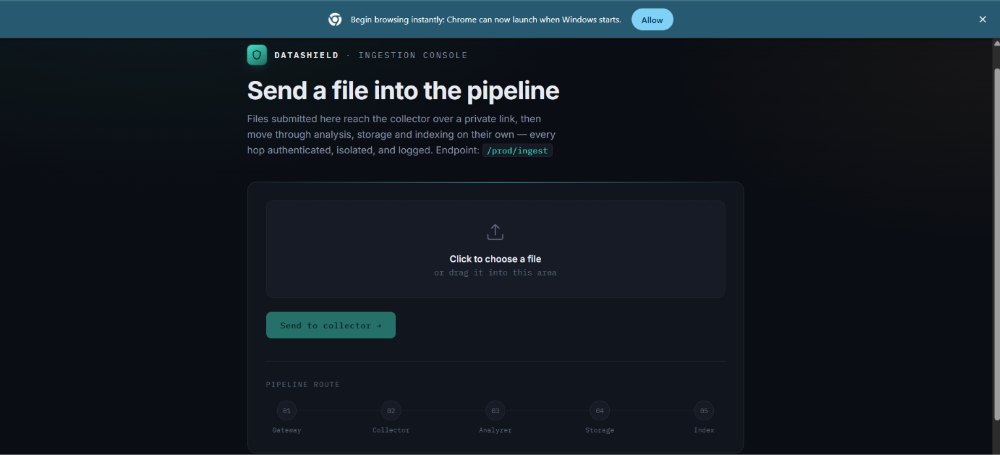

# DataShield – Segmented Secure Analytics Pipeline

A secure, automated and segmented Linux + AWS analytics pipeline that ingests data through a controlled public entry point, transfers it through private processing tiers, stores processed output in S3, archives raw data on LUKS-encrypted storage, records metadata in private RDS through Lambda, and exposes retrieval through a load-balanced scalable service tier.

> **Project publication status:** Repository structure and documentation are being assembled directly from the DataShield GitHub End-to-End Project Publishing Guide. Implementation code, screenshots, architecture evidence, and the final report will be added only from the actual project materials.

## Architecture

## Core Design

- VPC: 10.60.0.0/16
- 7 segmented subnets
- Collector and Analyzer in private subnets
- RDS in a private DB subnet with no public access
- Archive EC2 in an isolated subnet with LUKS-encrypted EBS storage
- S3 versioning, lifecycle management, encryption and blocked public access
- S3 event → Lambda → RDS metadata pipeline
- Service tier behind ALB with Auto Scaling (min 2 / max 6)
- Linux Cron automation for Collector and Analyzer workflows

## End-to-End Flow

Client → API Gateway → ALB-Collector → Collector → Analyzer → S3 + Archive → Lambda → RDS → Service → ALB-Project → Client

## Network Design

| Subnet | CIDR | Purpose |
|---|---|---|
| Public-Edge-Subnet-A | 10.60.1.0/24 | Public ALB edge + NAT Gateway |
| Public-Edge-Subnet-B | 10.60.2.0/24 | Second public ALB edge / multi-AZ |
| Private-Collector-Subnet | 10.60.10.0/24 | Collector EC2 |
| Private-Analyzer-Subnet | 10.60.20.0/24 | Analyzer EC2 |
| Private-Service-Subnet | 10.60.30.0/24 | Service EC2 / ASG |
| Private-DB-Subnet | 10.60.40.0/24 | Private RDS MySQL |
| Isolated-Archive-Subnet | 10.60.50.0/24 | Archive EC2 + LUKS EBS |

VPC CIDR: 10.60.0.0/16

Detailed network documentation: [architecture/subnet-plan.md](architecture/subnet-plan.md)

## Repository Structure

    datashield-segmented-secure-analytics/
    ├── README.md
    ├── LICENSE
    ├── .gitignore
    ├── architecture/
    ├── collector/
    ├── analyzer/
    ├── service/
    ├── lambda/
    ├── database/
    ├── archive/
    ├── iam/
    ├── aws-config/
    ├── tests/
    ├── screenshots/
    └── docs/

The complete required file structure follows the project publishing guide and will be populated as the corresponding real project materials are supplied and verified.

## Implementation

- [Collector](collector/)
- [Analyzer](analyzer/)
- [Archive](archive/)
- [Lambda](lambda/)
- [Database](database/)
- [Service](service/)
- [AWS configuration](aws-config/)
- [IAM](iam/)

## Testing & Evidence

The repository will document and evidence:

- /health
- /metadata/latest
- Collector → Analyzer transfer
- Analyzer → S3 upload
- Archive backup
- Lambda → RDS metadata insertion
- ALB target health
- Auto Scaling configuration
- End-to-end processing of a unique sample file

Evidence will contain only actual screenshots and outputs from the implemented project.

## Security Design

The published project will document:

- Least-privilege IAM controls
- Private RDS access
- No Collector-to-RDS path
- Isolated Archive subnet
- LUKS-encrypted archive storage
- Blocked S3 public access
- Security-group-to-security-group traffic controls
- Sanitized configuration examples with secrets removed

No passwords, private keys, access keys, session tokens, real credentials, or other secrets belong in this repository.

## Challenges & Learning

This section will be completed from the actual DataShield implementation/report rather than invented project results.

## Limitations / Future Improvements

This section will be completed from the actual project report and implementation.

## Author / Institute

**H BASAVA PRABHU**  
B.Tech – Computer Science Engineering  
IT Skill Nest

## Documentation

The final corrected project report will be published at:

docs/DataShield-Project-Report.pdf
